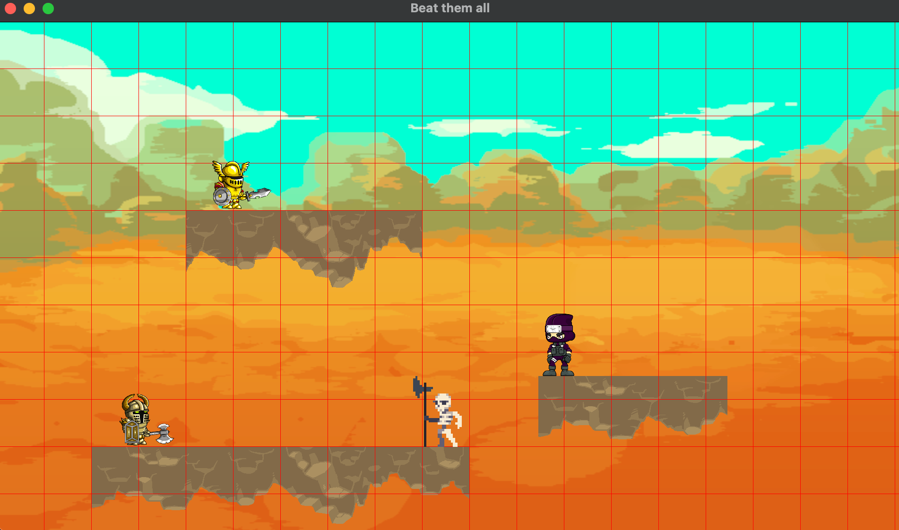

# BeatThemAll
2D fighting game using SFML.



# Compile
```
mkdir build
cd build
cmake ../
cmake --build .
```


# Class
## GameObject
GameObject is drawable object in game. 

```
GameObject
   ^
   |
   |--- Character
   |        ^
   |        |----- Knight
   |        |----- Ninja
   |        |----- Skeleton
   |        |----- Warrior
   |
   |--- DebugRectangle
   |        
   |--- Grid
   |
   |--- Map
```

## Player
Player is logic object, presents for each player.

